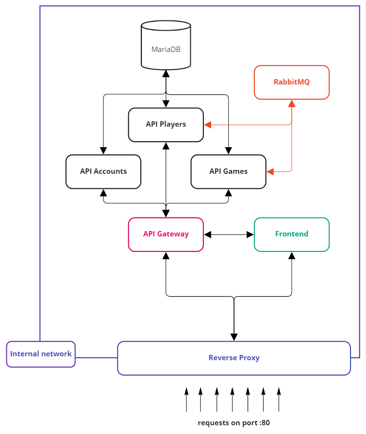
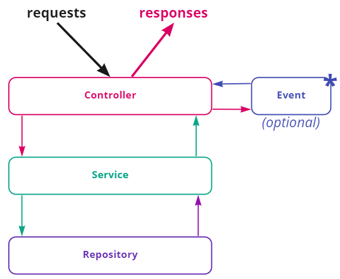

# Gameplay Flask API

---

Application was created for games and their players management mainly during playing board games at home. 
Created as microservices system on scratch. Ready to launch using only one docker command 😊.

--- 

## Table of contents

- [Project launching](#project-launching)
  - [Docker style](#docker-style)
  - [Pure python](#pure-python)
- [Project description and assumption](#project-description-and-assumption)
  - [Motivation and inspiration](#motivation-and-inspiration)
  - [Why Flask](#why-flask)
  - [REST endpoints](#rest-endpoints)
- [System structure](#system-structure)
- [Modules descriptions](#modules-descriptions)
  - [API Accounts](#api_accounts) 
  - [API Games](#api_games) 
  - [API Players](#api_players)
  - [Frontend](#frontend)
  - [(Docker) API Gateway](#(Docker)-api_gateway)
  - [(Docker) Reverse Proxy](#(Docker)-reverse_proxy)
- [Swagger](#swagger)
- [Technology used](#technology-used)
- [License](#license--copyright)

---

## Project launching 

### Docker style
Project was created to use Docker containers for easy management and launching. All Docker files are located in
`/.docker/` folder. For each module (container) separated folder was created with prepared *Dockerfile* files 
ready to use with docker-compose.yml file and docker-compose commands.

There are few more modules needed to proper working the microservices application - `/reverse_proxy/` and 
`/api_gateway/` on `/.docker/` folder. Their purposes are explained in chapter [System structure](#system-structure).

To launch whole application using docker-compose command use (*-d* for detached mode):
```shell
docker-compose up [-d]
```
Application should launch automatically and should be reachable at the address **127.0.0.1** on port **80**

### Pure python
It is possible to lunch each module separately using pure python on console. 
Each module contains files `run.sh` and `run.bat` ready to use on Linux and Windows systems.
To launch module use command:
```shell
./run.[sh|bat]
```
Application should launch automatically in the console. **However** it is needed to change configuration file
(or config parameters) from production to development due the fact that production config for docker have defined urls to other 
services in relation to the API gateway. 

---

## Project description and assumption
Project was invented for the needs of measuring and storing the players points of a board games at home. 
Due to ecology and not wasting paper for writing games statuses on them (which are always disappear 😬) 
the *"Gameplay Flask API"* was created. According to that, players, games and accounts APIs services were created.
For more user-friendly graphic presentation of everything common webpage with frontend was implemented as
a part of project.

### Motivation and inspiration
There was one more motive (which was even more important) besides the measuring board games points.
It was the willingness to learn the microservice system structure and the willingness to learn something new.

Inspiration for that was one of the subject at my University during studies - *"Component distributed systems"*, on which
theoretical issues related to microservices was presented.

### Why Flask?
I have decided to use Flask because:
1. I wanted to learn new Python framework except the Django I worked with,
2. Flask is smaller and more "pure" than Django which demands using additional Python packages,
3. Flask has many followers to help solve any problem if needed.

### REST endpoints
All APIs endpoints were created using REST API design principle. All information from APIs are
reachable at specific endpoints designed in the same way for each API module.
Each of urls starts from */api/* root part. Example for API Players:

|     Endpoint          |             Response                          |
|:----------------------|:----------------------------------------------|
| /players              | List of existing players                      |
| /players/{id}         | Details of player with id = {id} or code 404  |
| /players/{id}/image   | Image of player with id = {id} or code 404    |

All endpoints can only be called using specific request types. Otherwise, error 400 will be returned. 
Example for previous API Players endpoints:

| Endpoint            | GET | POST | DELETE | PUT |
|---------------------|:---:|:----:|:------:|:---:|
| /players            |✅|✅|❌|❌|
| /players/{id}       |✅|❌|✅|✅|
| /players/{id}/image |✅|✅|✅|✅|

If the docker launching is used all requests will be going first to the API Gateway which manage 
to which microservice this request should be sent.

---

## System structure

Project was created with microservices in mind from the beginning. Its current structure describes image bellow.



All API services are placed inside the internal network to which nobody has access. 
All requests have to be sent to Reverse Proxy service (127.0.0.1:80) which decide to which service
(Frontend or API Gateway) request should be sent. RabbitMQ is the cloud service on external servers 
to which API_Players and API_Games have connection to. One of the future tasks contains changing 
that to another service inside internal application network.

---

## Modules descriptions
All modules have the same structure split to 3 separated layers:
- **controller** responsible for handling pure requests, checking their types, validating parameters etc. Uses **service** layer functions,
- **service** shares function needed to proper working controller layer. Uses **repository** layer functions,
- **repository** responsible for connection with the database and for operation on them. Shares functions for **service** layer.

Image represents that structure is placed below.



In some modules, there is one more layer - **Event**. That element is responsible for handling events like 
creating/deleting/updating new objects needed to proper working for other services. For example, if existing player
is deleted (using API Players) API Games needs that information to delete him in its database.
**Event** layer is responsible for sending that information to other services. Directly to RabbitMQ from 
which other services could take messages.

### api_accounts
API created for Accounts management. Accounts have roles which defines rights to create/edit games or players.
If objects initialization is enabled in config file then some accounts are created after system launching. 

Login data for administrator with all rights are:
- login: admin
- password: admin

Login data for common Guest without rights to editing/creating/adding are;
- login: guest
- password: guest

### api_games
API created for Games management. Games could have a players with set points. If objects initialization is enabled
in config file then some games are created after system launching. 

### api_players
API created for Players management. Players could have a specific profile icon which shows with players nickname.
If objects initialization is enabled in config file then some players are created after system launching. 

### frontend
Service created for user-friendly showing and management of whole system. Frontend is created using Bootstrap 
framework to make them more professional and good-looking.

### (Docker) api_gateway
Service created only for containerize whole project. It is entry point to API services. Thanks to that other services 
never has to worry about proper address to specific service. It was created using nginx.

### (Docker) reverse_proxy
Service created only for containerize whole project. It is entry point to system for all users. 
Thanks to that whole structure of the system is hid from the user. It was created using nginx.

---

## Swagger

Each API service contains swagger page created. It is easy to reach them. `127.0.0.1:80/api/[application]/swagger` is the request path to each swagger.
For example, if you want to see:
- API_Players swagger You have to go to `127.0.0.1:80/api/players/swagger`,
- API_Games swagger You have to go to `127.0.0.1:80/api/games/swagger`

Each swagger web page was created using swagger.json file located in each module in `/[module]/src/static/swagger` folder.

---

## Technology used
1. Python 3.10
   - Flask
   - Flask-RESTful
   - SQLAlchemy
   - requests
2. Docker
3. RabbitMQ
4. Bootstrap

---

## License & copyright
© All rights reserved